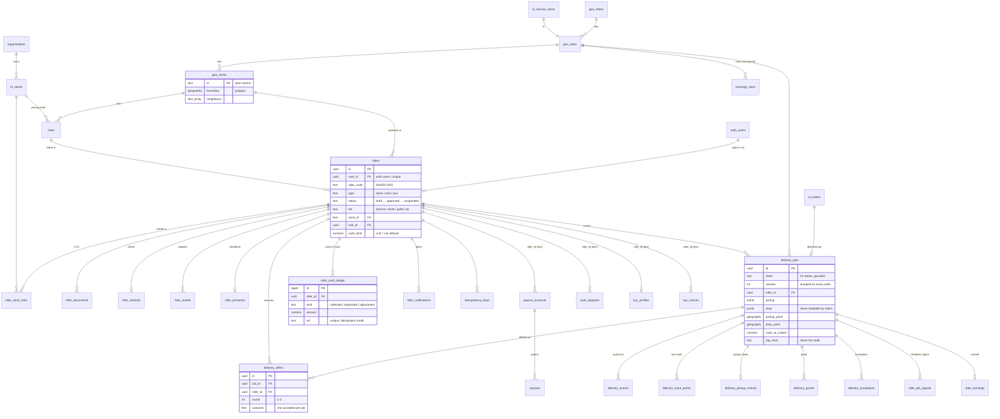

# Database schema

The OneLocal Rider data lives in the Supabase Postgres database (with **PostGIS** for zones, pins and
distances). It is the spec's §6 schema, made concrete in
[`supabase/migrations/20261002000000_rider_core.sql`](../../../supabase/migrations/20261002000000_rider_core.sql),
plus the tables the messaging, payouts, cash deposit and KYC services already created.

**Who writes:** only the server (the One Local server and the Edge Functions, with the service role).
**Who reads:** the server; the rider app reads nothing directly except four of its own rows for
Realtime (below). Everything else reaches the app through the API, which applies the privacy rules.

## Apply it

From the repository root, on your computer:

```bash
export SUPABASE_ACCESS_TOKEN=sbp_…            # supabase.com/dashboard/account/tokens
bash supabase/setup-database.sh               # shows the pending migrations, then applies them
bash supabase/setup-database.sh seed          # dev / staging only: also loads the Latur seed
bash supabase/setup-database.sh status        # applied vs pending
```

The other setup scripts (`setup-payouts.sh`, `setup-kyc.sh`, …) run the same `supabase db push`, so
they apply this schema too. Locally, `supabase db reset` applies every migration and `supabase/seed.sql`.

The Master tables this schema points at (`organizations`, `ol_service_areas`, `ol_stores`,
`ol_orders`, `app_devices`) are created only if they don't exist yet; on the One Local Master
database they are left exactly as they are (no columns, comments, grants or RLS touched).

## Diagram



## Tables

### Geography (spec §2)

| Table | What it holds |
|---|---|
| `geo_states` | State (`MH`): name, default app language. |
| `geo_cities` | City (`latur`), = `ol_service_areas.city_id`: outline (multipolygon), centre, time zone, default **cash limit** (₹2,000). |
| `geo_zones` | Dispatch zones: polygon, `neighbours` (widen dispatch rounds), `active`. A rider must be inside an active zone to go online. |
| `hubs` | A point: a store, a dark store, or a rider's start pin — coordinates first, address text second (R4); accuracy, source, entrance note. |

### Riders and onboarding

| Table | What it holds |
|---|---|
| `riders` | One row per rider (identity = `auth.users` by phone, D1): code, name, language, type, **status** (only `approved` can go online), tier, zone, hub, categories, acceptance mode, cash-limit override, referral code. |
| `rider_store_links` | Store riders ↔ stores (invite code): priority, status, payout multiplier. |
| `rider_assets` | Uploads in the private Storage bucket `rider-private` (KYC images, proof photos, signatures). Served only through short-lived signed URLs. |
| `rider_documents` | The current document per kind (Aadhaar, PAN, DL, RC, selfie, permit, fitness): **masked number only**, status, refusal reason, expiry. |
| `rider_vehicles` | Class (2w/3w/4w), own/rent, registration, the RC document. |
| `rider_presence` | Latest heartbeat: online, location, accuracy, battery, app state, current job. Dispatch searches it by distance. |

### Deliveries (spec §4)

| Table | What it holds |
|---|---|
| `delivery_jobs` | One delivery: the **state** (12-step engine + failed / returned / cancelled), `version`, rider, pickup / drop (JSON + PostGIS points), items, cash to collect, distances, hashed pickup code and OTP (5 tries then locked), proof methods, payout estimate, surge, earnings-rule version, merchant note / ready time, deadlines, review flags. |
| `delivery_offers` | One row per offer per dispatch round (1–3): mode, payout shown, expiry, outcome. |
| `delivery_events` | Audit trail of every state change: actor, location, reason, app; `recorded_at` = device time of an offline step replayed later; idempotency key per job. |
| `delivery_track_points` | Live track during a job. Kept 30 days, then summed into `distance_travelled_km`. |
| `delivery_pickup_checks` | Pickup verification (scan / code / bypass with reason), item checklist, missing items. |
| `delivery_proofs` | OTP / photo / signature proof, distance from the drop pin (far = accepted but flagged), cash collected. |
| `delivery_exceptions` | Exceptions per state (not ready, mismatch, vehicle, unavailable, address, refused, …) and SOS; waiting time, corrected pin, resolution. |
| `address_quality` | Learned confidence of a customer pin from rider corrections and disputes. |
| `rider_job_signals` | Realtime nudge: `(job, rider, state, version)` only — see below. |

### Money

| Table | What it holds |
|---|---|
| `earnings_rules` | Per-city, versioned: base, per km, peak windows (JSON), free waiting minutes, per-minute wait pay (R10). |
| `rider_earnings` | Final earnings of a delivered job: base, distance, peak, wait, tip, bonus, total, the rule version used. |
| `rider_cash_ledger` | Cash in hand, **insert-only**: `collected` adds, `deposited` removes, `adjustment` is signed. `ref` makes a credit idempotent (e.g. `cash_deposits.id`). View **`rider_cash_balance`** = cash in hand + limit. |
| `payout_accounts`, `payouts` | Cashfree payout accounts (masked) and transfers — [PAYOUTS.md](PAYOUTS.md). |
| `cash_deposits` | COD cash paid by UPI through Cashfree PG — [PAYMENTS.md](PAYMENTS.md). |

### Verification, messages, platform

| Table | What it holds |
|---|---|
| `kyc_profiles`, `kyc_checks` | Cashfree Secure ID results (masked) and every check made — [KYC.md](KYC.md). |
| `message_log`, `whatsapp_capability` | WhatsApp / SMS / email log (hashed + masked recipients) — [MESSAGING.md](MESSAGING.md). |
| `rider_notifications` | In-app alerts (never a customer's name, phone or address). |
| `idempotency_keys` | `Idempotency-Key` of state-changing requests: a replay returns the stored response. Kept 7 days. |
| `organizations`, `ol_service_areas`, `ol_stores`, `ol_orders`, `app_devices` | Master tables (created only if missing). Push tokens go in `app_devices` with `app = 'rider'` (D2). |

The Cashfree and messaging tables key riders by `rider_id text` (= `riders.id` as text) and keep
money in paise; the rider tables use `uuid` foreign keys and rupees (`numeric(10,2)`).

## Rules the database enforces

| Rule | How |
|---|---|
| Delivery steps only move forward | Trigger `delivery_jobs_guard` allows exactly the transitions of the app's state machine (`delivery_transition_allowed`, kept in step with `TRANSITIONS` in `src/state-machine/deliveryStateMachine.ts` by a test). A job starts as `created` / `offered`; `accepted` needs a rider; final states never change; reassigning (`accepted → offered`) releases the rider. Refusals raise `invalid_transition`. |
| No double-advance | Every write sets `version = old + 1` (callers can't set it). The server updates `… where id = $1 and version = $expected`; a stale version updates nothing. |
| Timestamps | `accepted_at`, `picked_up_at`, `delivered_at` are stamped by the trigger. |
| One rider per job | Unique index: only one `accepted` offer per job. Offers have rounds 1–3. |
| Offline replays count once | `delivery_events (job_id, idempotency_key)` and `idempotency_keys (rider_id, key)` are unique. |
| Cash can't be rewritten | `rider_cash_ledger` rejects UPDATE and DELETE; corrections are `adjustment` rows; `collected` / `deposited` must be positive; `ref` is unique. |
| Dispatch | `zone_for_point(lat, lng)` → zone or null (out of zone); `riders_near(lat, lng, radius_m)` → online, approved, free riders nearest first. |
| Retention | Daily (`pg_cron`, `rider-retention`): track points > 30 days are summed into the job and deleted; idempotency keys > 7 days and signals of finished jobs > 7 days are deleted. |

## Security

* **RLS on every table.** The `anon` and `authenticated` roles are revoked everywhere, and EXECUTE on
  the helper functions is revoked too (Supabase would otherwise expose them as `/rpc`).
* The app (signed in, `authenticated`) may only **select its own rows** of four tables:
  `riders`, `delivery_offers`, `rider_job_signals`, `rider_notifications` — the ones published to
  Supabase Realtime. It can't read jobs, customers, other riders, money or KYC tables, and can't
  write anything.
* **No customer data reaches a rider directly.** `delivery_jobs.drop` (address, name, phone) is
  server-only; the API sends the full address only after `pickup_verified` and the phone only during
  the job. Only hashes of the OTP and pickup code are stored. Documents keep masked numbers.
* KYC images and proof photos are in the private bucket `rider-private`.

### Realtime in the app

Subscribe to `rider_job_signals` filtered by `rider_id=eq.<riders.id>` (and `delivery_offers` for new
offers). A signal carries only the job id, state and version; on a change the app refetches the job
from the API. When a job is taken away, the rider's signal turns `state = 'reassigned'` (no delete,
so other riders never receive an event about it).

## Spec §6 → this schema

| Spec | Here |
|---|---|
| All §6 tables | Same names and columns, with checks, indexes and the additions below. |
| `rider_payout_methods` | `payout_accounts` (Cashfree beneficiary, masked account / UPI, bank name, name match) |
| `rider_payouts` | `payouts` (Cashfree transfer: instant or weekly, status, UTR) |
| — | Added: `rider_assets`, `rider_job_signals`, `idempotency_keys`, `cash_deposits`, `kyc_profiles`, `kyc_checks`, `message_log`, `whatsapp_capability`, view `rider_cash_balance` |
| Columns added | `riders`: rider_code, email, tier, submitted_at / approved_at · `rider_store_links`: payout_multiplier, invited_with · `delivery_jobs`: order_ref, store_id, items, pickup_code_hash, otp_locked_at, surge_multiplier, merchant_note / ready_at, accepted / picked_up / delivered_at, distance_travelled_km, failure_reason, flags · `delivery_offers`: payout_estimate · `delivery_events`: idempotency_key, recorded_at · `delivery_proofs`: flagged, cash_collected · `delivery_exceptions`: wait_started_at · `rider_cash_ledger`: source, ref, note |

## Seed (development)

[`supabase/seed.sql`](../../../supabase/seed.sql) holds the same Latur world as the app's local demo,
with no people in it: Maharashtra → Latur → zones `latur-central`, `latur-east`, `latur-west`,
`latur-north`; Express MegaMart and its **Store A** hub; Latur earnings rule v3 (₹45 base, ₹6/km,
₹15 lunch and dinner peaks, 10 free waiting minutes then ₹2/min — sample rates). Safe to run twice.

## Tests

`cd supabase/tests && npm install && npm test` runs `schema.test.ts` on a real Postgres 18 + PostGIS
(PGlite, in-process): every migration and the seed are applied, then RLS and grants, the state machine
(parity with the app), versions, reassignment signals, one accepted offer, the ledger, zone lookup,
nearest riders, retention, and that existing Master tables are left untouched.
